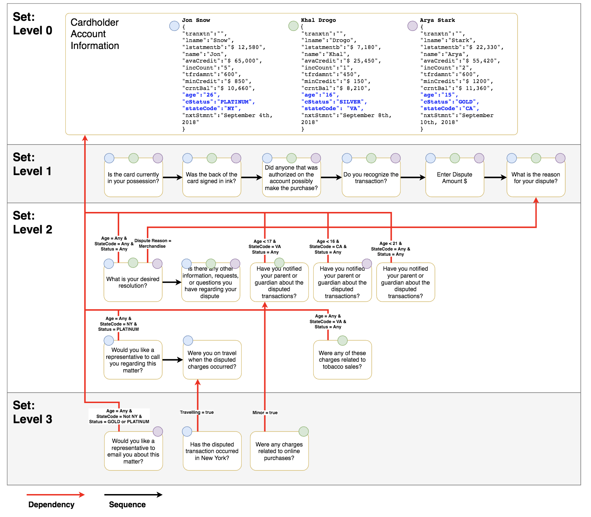
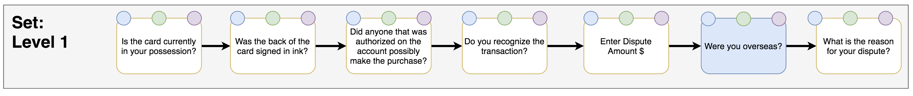
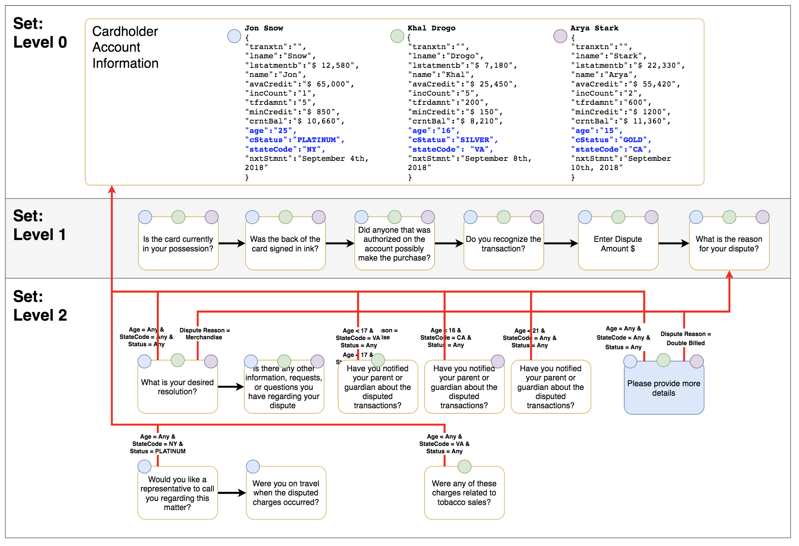
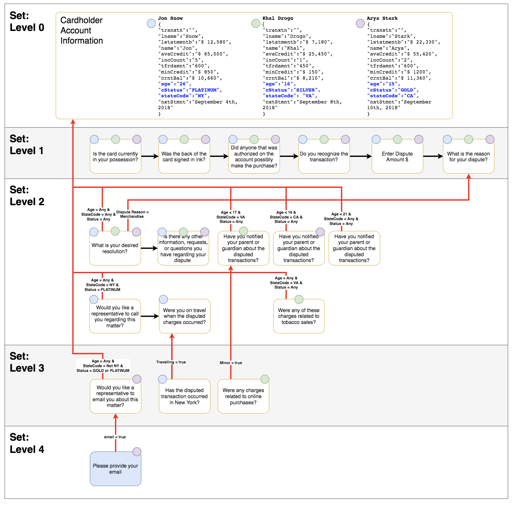
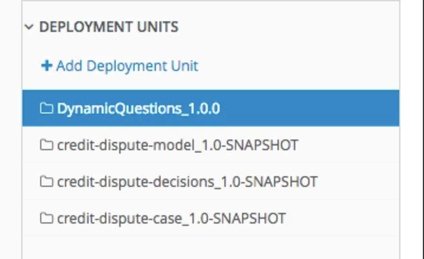
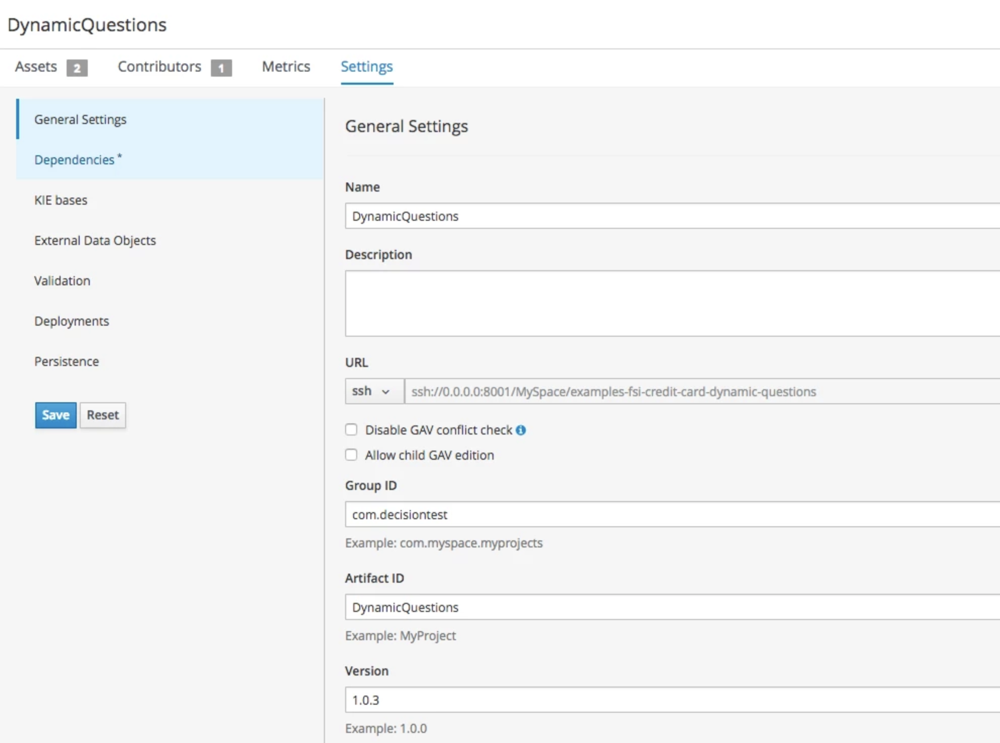
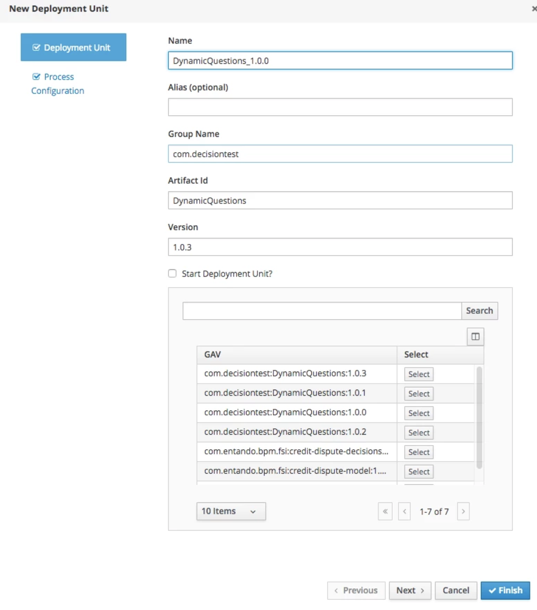
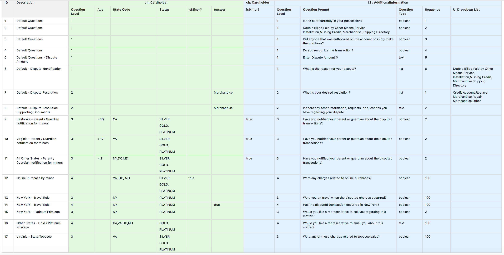

FSI CCD Demo - Business Rule Design
====================================

Dynamic Question Tree
====================================

 
# Considerations

1.	Dynamic Questions decision table derives the next set of questions based on the answer to the last question (scenario) in the previous set. The Sequence number of the last question is set to 100, this is just to let SA know that it is the last question.
2.	The UI is designed in such a way that when UI makes the first call to the decision table, it starts with level 1(set 1) and increment the value whenever UI makes another call to keep extracting the questions until it received an empty response.

# Scenarios

Below are the scenarios to demonstrate how the changes from the business can be incorporated in a "Dynamic Questions" guided decision table without impacting the UI.

## Scenario 1

### Description
Adding more options to the "Dispute Reason" drop-down.
### Steps
1.	Currently, the drop-down is displaying the following options (Double Billed, Paid by Other Means, Service Installation, Missing Credit, Merchandise, Shipping Directory)
2.	Look for rule "Default - Dispute Identification". Once located, go to the last column "UI Dropdown List" and add a new option "Wrong Amount" to the end of the list. (Please use commas appropriately).
3.	The new list should look like (Double Billed, Paid by Other Means, Service Installation, Missing Credit, Merchandise, Shipping Directory, Wrong Amount)
4.	Follow the steps described in the section "Build & Deployment Instructions" on this page.

## Scenario 2

### Description
Adding a new question on Set 1

### Steps
1.	Currently, there are total six questions in Set 1 and as part of this scenario, we will add one new question after question five "Enter Dispute Amount $".
2.	In this scenario, we need to make sure that the new question is part of Set 1(Question Level) and the order of this question is set appropriately.
3.	Select "Default Questions - Dispute Amount" rule and click "Insert" → "Insert row below". 
4.	Enter below values to the new row: 
1.	Description: Default - Overseas
2.	Question Level: 1
3.	Question Prompt: Were you overseas?
4.	Question Type: boolean
5.	Sequence: 6
5.	After the above changes, you should now have total 7 questions on Question Level 1.
6.	Save the changes
7.	Follow the steps described in the section "Build & Deployment Instructions" on this page.

## Scenario 3

### Description
Adding a new question on set 2 such that it depends on an answer to a question on set 1.
Currently, if a user selects  "Dispute Reason" as "Merchandise" in set 1, two extra questions in Set 2 are displayed. In this scenario, we will demonstrate, if a user selects "Double Billed" option in "Dispute Reason" in set 1, then a new question will be asked to a user in set 2.

### Steps
1.	Currently, if a user selects  "Dispute Reason" as "Merchandise" in set 1, two extra questions in Set 2 are displayed. In this scenario, we will demonstrate, if a user selects "Double Billed" option in "Dispute Reason" in set 1, then a new question will be asked to a user in set 2.
2.	Insert Row and the following values: 
1.	Description: Double Billed - Dispute Reason
2.	Question Level: 2
3.	Answer: Double Billed
4.	Question Prompt: Please provide more details
5.	Question Type: text
6.	Sequence: 1
3.	Follow the steps described in the section "Build & Deployment Instructions" on this page.

## Scenario 4

### Description
Adding new level.

### Steps
1.	Currently, if a user status is "GOLD" or "PLATINUM" and belongs to any state except NY, we are displaying a question "Would you like a representative to email you?".
2.	As part of this scenario, if the user answers "yes", then we are adding a new question at the next level.
3.	Insert Row and the following values: 
1.	Description: Other States - Gold / Platinum Privilege
2.	Question Level: 4
3.	Question Prompt: Please provide your email id
4.	Question Type: text
5.	Sequence: 1
4.	Follow the steps described in the section "Build & Deployment Instructions" on this page.

# Build & Deployment Instructions

The way PAM projects are built and deployed on the local machine is different to the way they are deployed to OpenShift environment.
Below are the instructions to build and deploy PAM projects on Openshift environment:
* Copy the Deployment Unit name of the PAM project you want to build and deploy and save it somewhere. To copy the name, navigate to Menu → Execution Servers and you will see deployment units like below: for example, I copied "DynamicQuestions_1.0.0"

* Stay on the same page as above and remove the Deployment Unit. To remove the deployment unit, select the deployment unit you want to remove and do the following: 
	* Stop the server and refresh the page to make sure that server is stopped.
	* Once the server is stopped, remove the deployment unit by clicking on "Remove" button.
	* Refresh the page to ensure that the deployment unit is removed.
* Now go back to the PAM project you made changes. Increase the version from the current version to next version. To increase the version, navigate to Menu → Projects → <project name> → Settings. Increase the version on the version field and save your changes.

* Build and Deploy the project.
* Navigate to Menu → Execution Servers and you will see deployment units along with the newly deployed project with the version number you provided. Example → "DynamicQuestions_1.0.3". This means that the endpoint of your project is also changed, this is not ideal for real-world scenario, therefore, we will delete this deployment unit and deploy the project manually with the latest version but old name so that the end point remains the same.
* To delete the newly deployed deployment unit, follow Step 2.
* After completing Step 2, stay on the Deployment Unit screen and click on "Add Deployment Unit" option.
* Select the deployment unit which you deleted on Step 6 and click on "Select" button. Change the name of the deployment unit with the name you copied on Step 1 and click on "Finish" button. This will deploy the latest changes without impacting the end-point.

 
# Data Objects

## Cardholder
Identifier | Type
---------- | ----
age | Integer
answer | String
balanceRatio | Float
incidentCount |	Integer
isMinor | String
questionLevel |	Integer
stateCode | String
status | String

## AdditionalInformation
Identifier | Type
---------- | ----
answerValue | String
listOptions | String
questionId | Integer
questionLevel | Integer
questionOrder | Integer
questionPrompt | String
questionType | String
 
 
# Business Rules

 
## Scenario-1: Dynamic questions based on rules

 
 
## Example: To return multiple questions for a given choice
For this scenario, on row 2 and 3, the Next Question ID of Cardholder object value is set to 0
### API Request
API Request 
{
  "lookup" : null,
  "commands" : [ {
    "insert" : {
			"object" : {"com.fsi.creditcarddisputecase.Cardholder":{
				"questionLevel" : 1,
				"age" : 14,
				"stateCode" : "VA",
				"status" : "SILVER"
				
}},
      
      "out-identifier" : "cardholder",
      "return-object" : true,
      "entry-point" : "DEFAULT",
      "disconnected" : false
    }
  }, {
    "set-focus" : {
      "name" : "dynamic-questions"
    }
  }, {
    "fire-all-rules" : {
      "max" : -1,
      "out-identifier" : "dynamic-questions-fired"
    }
  }, {
    "get-objects" : {
      "class-object-filter" : null,
      "out-identifier" : "test1"
    }
  }, {
    "set-focus" : {
      "name" : "cleanup-questions"
    }
  }, {
    "fire-all-rules" : {
      "max" : -1,
      "out-identifier" : "cleanup-questions-fired"
    }
  }, {
    "set-focus" : {
      "name" : "cleanup-cardholder"
    }
  }, {
    "fire-all-rules" : {
      "max" : -1,
      "out-identifier" : "cleanup-cardholder-fired"
    }
  }  ]
}

### API Response
API Response 
{
	"type": "SUCCESS",
	"msg": "Container DynamicQuestions_1.0.0 successfully called.",
	"result": {
		"execution-results": {
			"results": [
				{
					"value": 6,
					"key": "dynamic-questions-fired"
				},
				{
					"value": 1,
					"key": "cleanup-cardholder-fired"
				},
				{
					"value": 6,
					"key": "cleanup-questions-fired"
				},
				{
					"value": {
						"com.fsi.creditcarddisputecase.Cardholder": {
							"stateCode": "VA",
							"age": 14,
							"status": "SILVER",
							"incidentCount": null,
							"balanceRatio": null,
							"isMinor": null,
							"answer": null,
							"questionLevel": 1
						}
					},
					"key": "cardholder"
				},
				{
					"value": [
						{
							"com.fsi.creditcarddisputecase.Cardholder": {
								"stateCode": "VA",
								"age": 14,
								"status": "SILVER",
								"incidentCount": null,
								"balanceRatio": null,
								"isMinor": null,
								"answer": null,
								"questionLevel": 1
							}
						},
						{
							"com.fsi.creditcarddisputecase.AdditionalInformation": {
								"questionId": null,
								"answerValue": null,
								"questionType": "text",
								"questionPrompt": "Enter Dispute Amount $",
								"questionOrder": 5,
								"questionLevel": 1,
								"listOptions": null
							}
						},
						{
							"com.fsi.creditcarddisputecase.AdditionalInformation": {
								"questionId": null,
								"answerValue": null,
								"questionType": "boolean",
								"questionPrompt": "Was the back of the card signed in ink?",
								"questionOrder": 2,
								"questionLevel": 1,
								"listOptions": null
							}
						},
						{
							"com.fsi.creditcarddisputecase.AdditionalInformation": {
								"questionId": null,
								"answerValue": null,
								"questionType": "list",
								"questionPrompt": "What is the reason for your dispute?",
								"questionOrder": 6,
								"questionLevel": 1,
								"listOptions": "Double Billed,Paid by Other Means,Service Installation,Missing Credit, Merchandise,Shipping Directory"
							}
						},
						{
							"com.fsi.creditcarddisputecase.AdditionalInformation": {
								"questionId": null,
								"answerValue": null,
								"questionType": "boolean",
								"questionPrompt": "Did anyone that was authorized on the account possibly make the purchase?",
								"questionOrder": 3,
								"questionLevel": 1,
								"listOptions": null
							}
						},
						{
							"com.fsi.creditcarddisputecase.AdditionalInformation": {
								"questionId": null,
								"answerValue": null,
								"questionType": "boolean",
								"questionPrompt": "Is the card currently in your possession?",
								"questionOrder": 1,
								"questionLevel": 1,
								"listOptions": null
							}
						},
						{
							"com.fsi.creditcarddisputecase.AdditionalInformation": {
								"questionId": null,
								"answerValue": null,
								"questionType": "boolean",
								"questionPrompt": "Do you recognize the transaction?",
								"questionOrder": 4,
								"questionLevel": 1,
								"listOptions": null
							}
						}
					],
					"key": "test1"
				}
			],
			"facts": [
				{
					"value": {
						"org.drools.core.common.DefaultFactHandle": {
							"external-form": "0:1:1770434905:1770434905:1:DEFAULT:NON_TRAIT:com.fsi.creditcarddisputecase.Cardholder"
						}
					},
					"key": "cardholder"
				}
			]
		}
	}
}
Leonardo Consulting © 
